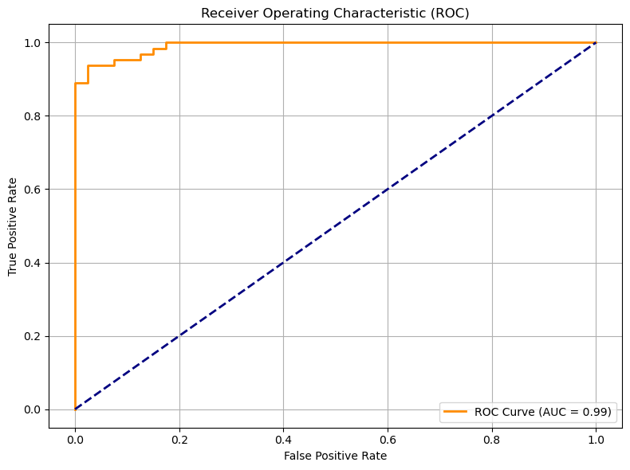
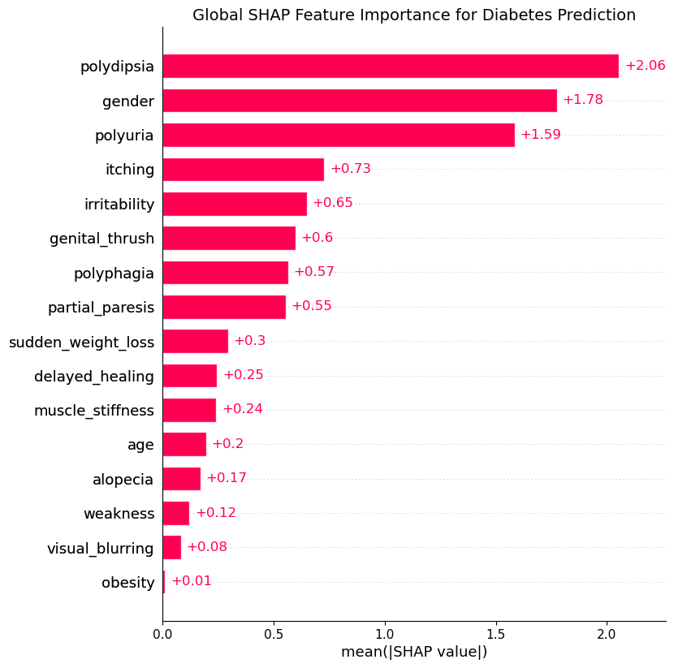
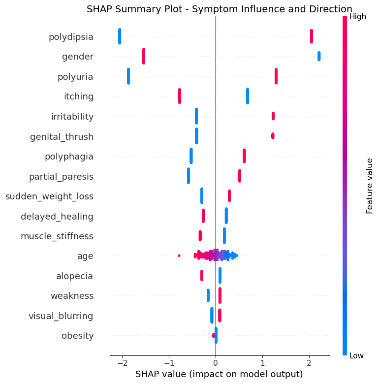
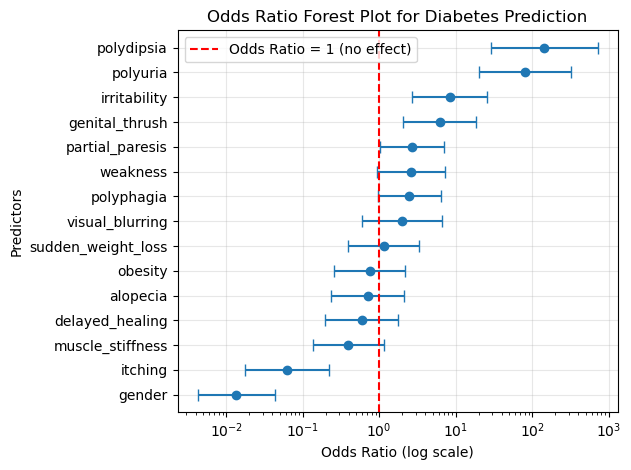

# Early Stage Diabetes Risk Prediction Analysis

## DS Team 5 Members
* Kristy Yiu
* Rebecca Laundos
* Lamoya Waldman
* Samantha Sathaseevan

## Table of Contents

* [Project Overview & Purpose](#project-overview--purpose)
* [Goals & Objectives](#goals--objectives)
* [Methodology](#methodology)
* [Data Preparation/Cleaning](#data-preparationcleaning)
* [Exploratory Data Analysis](#exploratory-data-analysis)
* [Risks, Limitations, & Unknowns](#risks-limitations--unknowns)
* [Regression Analysis & Validation](#regression-analysis--validation)
* [Conclusions & Discussion](#conclusions--discussion)
* [References & Acknowledgements](#references--acknowledgements)
* [Team Credits & Reflections](#team-credits--reflections)
* [Installation & Environment Setup](#installation--environment-setup)

---

## Project Overview & Purpose
**Source:** [UCI Machine Learning Repository - Early Stage Diabetes Risk Prediction Data](https://archive.ics.uci.edu/dataset/529/early+stage+diabetes+risk+prediction+dataset)

This project uses the Early Stage Diabetes Risk Prediction dataset to explore and identify whether there is a gender difference between significant predictors for early stage diabetes. The goal of this project is to reduce the long term impact of diabetes on the healthcare system by identifying gender-based differences in symptom presentation to enable primary care physicians to intervene earlier on with appropriate follow-up, triage, and prevention plans, as needed. 

**Business Problem:** 
Diabetes is a rapidly growing public health and economic challenge, driving substantial long-term costs for healthcare systems due to complications, hospitalizations, and chronic disease management. Early detection and intervention are critical to reducing these burdens, yet many cases of early-stage diabetes go undiagnosed until symptoms become severe.

A key obstacle in achieving timely diagnosis is the lack of gender-sensitive risk assessment tools. Current screening models and predictive algorithms often treat male and female patients as a single homogeneous group, overlooking potential differences in how symptoms present and progress across genders. This one-size-fits-all approach may result in delayed identification of at-risk patients, inefficient resource utilization, and missed opportunities for early preventive care.

This project addresses this gap by using the Early Stage Diabetes Risk Prediction dataset to explore and identify gender-based differences in the predictors of early-stage diabetes. Understanding how symptom patterns vary between men and women can help primary care providers and healthcare organizations:
* Develop more precise screening models that tailor risk prediction to patient demographics.
* Improve triage and follow-up protocols for patients presenting with early diabetes symptoms.
* Reduce long-term healthcare costs by enabling earlier, gender-informed interventions that prevent complications.
  
By uncovering actionable insights into gender differences in symptom presentation, this analysis supports evidence-based decision-making and strengthens healthcare systems’ ability to deliver proactive, personalized, and cost-effective diabetes management strategies.

---

## Goals & Objectives
The overarching project goal is to explore and identify significant demographic variables and clinical predictors of early-onset diabetes by gender to support targeted prevention and early intervention strategies.

To achieve the project goal, we have created the following objectives:
* Identify theoretically plausible confounders through literature and confirm whether these relationships appear in your dataset through exploratory analysis
* Evaluate demographic variables (age and gender) as predictors of early-onset diabetes using logistic regression to understand the baseline associations
* Evaluate clinical features (polyuria, polydipsia, sudden weakness, etc.) as predictors of early-onset diabetes to see how clinical symptoms relate independently to the condition
* Test for potential confounders and identify the variables which need to be adjusted
* Develop a combined, adjusted model with the most prominent demographic and clinical predictors to evaluate whether gender differences persist after adjustment

The most significant predictors are the ones that remain statistically significant after adjustment.

---

## Methodology
This project applies a data-driven approach to explore gender-based differences in predictors of early-stage diabetes using the Early Stage Diabetes Risk Prediction dataset. The methodology follows a structured analytical pipeline to ensure accuracy, interpretability, and reproducibility of results.

### Data Preparation/Cleaning
Before any analysis, the dataset will be assessed for completeness, consistency, and accuracy.
- Handling missing data: Verify if there are any null or inconsistent entries (e.g., blank cells or typos in “Yes/No” fields) and address them through imputation or removal as appropriate.
- Data type conversion: Convert categorical “Yes/No” responses into binary numerical values (1/0) and encode gender as a binary or categorical variable.
- Normalization and consistency checks: Confirm uniform variable naming, ensure correct value ranges (e.g., realistic age values), and identify potential outliers.
- Reproducibility: All cleaning steps will be implemented programmatically in Python to allow transparent and repeatable preprocessing.

### Literature Search
A literature search will be conducted to provide theoretical grounding for the variables, identify any known confounders, and support interpretation for statistical results. The information on confounders will be used to inform adjustment variables in our regression model.

Search #1
Database: PubMed
Search terms: 
("type 2 diabetes mellitus"[MeSH Terms] OR "type 2 diabetes" OR "diabetes mellitus, type 2")
AND ("sex differences" OR "gender differences" OR "male female comparison")
AND ("risk factors" OR predictors OR "clinical features" OR symptoms OR determinants)
AND (humans[MeSH Terms])
AND (English[lang])
Publication date: within last 5 years 
Language: English
Number of search results: 283

Search #2
Database: Google Scholar
Search terms: 
("type 2 diabetes mellitus"[MeSH Terms] OR "type 2 diabetes" OR "diabetes mellitus, type 2")
AND ("sex differences" OR "gender differences" OR "male female comparison")
AND ("risk factors" OR predictors OR "clinical features" OR symptoms OR determinants)
AND (humans[MeSH Terms])
AND (English[lang])
Publication date: since 2021
Language: English
Number of search results: 15 

Searches #1 and 2 did not yield sufficient relevant results so the search strategy (search terms) was revised for Search #3.

Search #3
Database: PubMed
Search terms: 
("Diabetes Mellitus, Type 2"[Mesh]) 
AND ("early-onset"[Title/Abstract] OR "premature"[Title/Abstract] OR "middle-aged"[Mesh] OR "adult"[Mesh]) 
AND ("Risk Factors"[Mesh] OR predictor*[Title/Abstract] OR "clinical features"[Title/Abstract] OR determinants[Title/Abstract] OR "associated factors"[Title/Abstract]) 
AND (Age[Mesh] OR "Sex Characteristics"[Mesh] OR "Obesity"[Mesh] OR "Body Mass Index"[Mesh] OR polyuria[Title/Abstract] OR polydipsia[Title/Abstract] OR "sudden weight loss"[Title/Abstract] OR weakness[Title/Abstract] OR polyphagia[Title/Abstract])
AND ("cohort study"[Publication Type] OR "case-control study"[Publication Type] OR "observational study"[Publication Type])
Publication date: within last 5 years
Language: English
Number of search results: 65

Search #3 also did not yield sufficient relevant results so Search #4 will be developed and presented in the final submission. 

### Descriptive and Exploratory Data Analysis
Exploratory data analysis will be conducted to understand the demographic and clinical characteristics of the population.
- Descriptive statistics: Summarize key variables (e.g., mean age, gender distribution, and prevalence of each symptom).
- Cross-tabulations: Compare symptom frequencies between diabetic and non-diabetic participants, as well as across genders.
- Visualization: Use pie charts, correlation matrix, bar plots, scatterplots, and heatmaps to identify potential patterns or correlations between symptoms and diabetes status.
- Preliminary insights: Identify which symptoms appear most common or distinctive between males and females diagnosed with diabetes.

### Regression Analysis and Validation
A statistical modeling approach will be applied to identify significant predictors of early-stage diabetes and assess gender-based differences.
- Logistic Regression (Primary Model)
  - Purpose: To estimate the relationship between predictor variables (age, symptoms) and the likelihood of diabetes (dependent variable: class).
  - Approach:
    - Perform logistic regression on the full dataset to determine overall predictors.
    - Conduct stratified regression analyses for males and females to compare significant predictors across genders.
    - Include interaction terms (e.g., Gender × Symptom) to test whether the relationship between symptoms and diabetes risk differs by gender.
  - Outputs: Odds ratios, confidence intervals, and p-values will be used to interpret the relative importance and significance of each predictor.

- Model Validation
  - Train-test split: The dataset will be split into training (80%) and testing (20%) sets to evaluate model generalizability.
  - Performance metrics: Assess model accuracy, precision, recall, F1-score, and ROC-AUC to ensure robust predictive performance.
  - Multicollinearity checks: Variance Inflation Factor (VIF) will be computed to ensure predictors are not highly correlated.

### Visualization of Findings
Visual analytics will be used to communicate insights clearly and effectively:
- Coefficient plots: Display relative influence of each predictor by gender.
- ROC curves: Compare model performance between male and female subgroups.
- Heatmaps and pair plots: Highlight relationships between symptoms and diabetes status.
- Summary visuals: Develop side-by-side charts to illustrate differences in key predictors across genders.

All visualizations will follow best practices in clarity, labeling, and accessibility to support interpretation by both technical and clinical stakeholders.

### Technical Considerations
Programming Environment
- Language: Python
- Development tools: Visual Studio Code for code execution, documentation and visualization

Libraries and their Purpose:
- NumPy: Efficient numerical operations and array manipulations.
- Pandas: Data loading, cleaning, and structured manipulation using DataFrames.
- Scikit-learn (preprocessing & modeling): Encoding categorical variables, splitting data, building logistic regression models, and evaluating performance metrics.
- Statsmodels: Statistical inference and regression diagnostics (e.g., p-values, odds ratios, and confidence intervals).
- Matplotlib: Creating foundational visualizations for trends, distributions, and comparisons.
- Seaborn: High-level statistical visualization for clear and aesthetically appealing plots (e.g., heatmaps, countplots).

---

## Data Preparation/Cleaning
A preliminary analysis of the dataset was conducted to evaluate its structure, suitability for analysis, and potential considerations relevant to our overarching goal: to explore and identify significant demographic variables and clinical predictors of early-onset diabetes by gender to support targeted prevention and early intervention strategies.

The dataset consists of 520 observations and 17 variables, including one outcome variable and a combination of demographic and symptom-based predictors. The response variable: class, indicates the presence or absence of early-stage diabetes classified as Positive or Negative. Predictor variables include demographic factors (Age and Gender) and 14 binary symptom indicators (e.g. Polyuria, Polydipsia, sudden weight loss, visual blurring, etc.).

All symptom-related variables and the outcome variable are recorded as binary categorical values (Yes/No), while Age is a numeric variable. A thorough review of the dataset using standard data integrity practices indicated that there were no missing values. All variables contained complete data for all 520 observations. The dataset is clean and does not require imputation or substantial preprocessing aside from applying standard data encoding methods to categorical variables within the dataset:
- 'Yes': 1 / 'No': 0
- 'Positive': 1 / 'Negative': 0
- 'Male': 1 / 'Female': 0

---

## Exploratory Data Analysis
### Objective 
To examine the Early Stage Diabetes Risk Prediction dataset to understand the data and uncover gender related patterns between symptoms and early-stage diabetes.

### Method 
The data was assessed to identify and summarize key differences in demographic variables (i.e. age and gender) and grouped by age and/or gender and diabetes classification using visualizations to highlight key relationships and find differences between men and women with diabetes.  

### Findings

<p align="center">


#### Figure 1: Diabetes Diagnosis Outcomes
An evaluation of the response variable: class, revealed a moderate class imbalance. Of the 520 participants in the dataset, 320 (~62%) were classified as Positive for diabetes, while 200 (~38%) were classified as Negative. Although not severely imbalanced, this distribution suggests the need for careful model evaluation. Metrics such as precision and recall may provide a more accurate assessment of model performance than accuracy alone. Additionally, extra care should be taken when interpreting model accuracy and sensitivity, particularly for underrepresented groups.


<p align="center">


#### Figure 2: Gender Distribution
The dataset consists of 192 (~37%) Female and 328 (~63%) Male participants, revealing a clear gender imbalance that could influence model predictions and limit generalizability. This imbalance has direct implications for our business problem since we’re comparing symptom-based predictors across gender. Therefore, models trained on the full dataset may be more heavily influenced by the male symptom observations due to their greater representation. Subsequent analyses may require gender-specific evaluations or consideration of stratification or bootstrapping techniques.


<p align="center">


#### Figure 3: Age Distribution
The age distribution in the dataset spans from 16 to 90 years. However, most participants fall between 35 and 60 years old, with fewer cases below 30 and above 70. The mean age is approximately 48 years with a median of 47.5 suggesting a fairly symmetric distribution centered around middle adulthood. The standard deviation of 12.15 years suggests moderate variability in age, with no indication of extreme outliers. This broad and balanced age spread is advantageous for our analysis as diabetes risk is known to increase with age and the inclusion of a wide age range improves the generalizability of our findings. In addition, this distribution aligns with the clinical understanding that early-stage diabetes is more prevalent among middle-aged adults, reinforcing the suitability of this dataset for studying early detection risk factors.


<p align="center">


#### Figure 4: Age and Diabetes Classification by Gender
The scatterplot of Age and Diabetes Classification by Gender illustrates how both males and females are affected across similar age ranges, although there are more male participants overall. Preliminary patterns suggest that age may interact differently with gender in predicting diabetes onset. For instance, females show a slightly higher concentration of positive diagnoses at younger ages compared to males, which could warrant further investigation into gender-specific risk factors and symptom presentation. Moreover, positive diagnoses appear more concentrated in participants between 40 and 55 years old, which may point to midlife as a key period for the onset of diabetes symptoms in both genders.


<p align="center">


#### Figure 5: Overall Symptom Prevalence Among All Participants
This bar chart shows the percentage of participants reporting each symptom across the full dataset. Weakness, polyuria, and itching were the most commonly reported symptoms, whereas irritability, genital thrush, and obesity were least prevalent. These findings suggest that general fatigue and urinary changes are widespread in the population and may warrant closer investigation in diabetes risk screening.


<p align="center">


#### Figure 6: Symptom Prevalence by Diabetes Status
The bar chart displays the proportion of participants reporting each symptom, grouped by diabetes classification. Polyuria, Polydipsia, and Sudden Weight Loss are most frequently observed amongst the diabetes-positive cases, with over 60% of diabetic participants experiencing these symptoms. Other symptoms such as sudden weight loss, weakness, and partial paresis are also notably elevated in diabetic participants. The remaining variables show more even distributions or low variance, which may limit their predictive relevance. These findings suggest that a subset of symptoms may have higher predictive power for diabetes diagnosis.From the perspective of the business case, these results reinforce the importance of early recognition of metabolic and neurological symptoms in diabetes screening. 


<p align="center">


#### Figure 7: Top Gender-Based Differences among Diabetic Participants
The chart displays the absolute percentage difference in symptom prevalence between male and female participants with diabetes. The largest disparities occur in alopecia, genital thrush, and partial paresis, indicating that dermatological and neuromuscular symptoms exhibit notable gender-specific patterns. Core metabolic symptoms such as polyuria, polydipsia, and weakness show minimal gender variation.


<p align="center">


#### Figure 8: Symptom Prevalence among Diabetic Participants by Gender
This heatmap compares symptom frequencies between male and female participants with diabetes. While both genders show high rates of polyuria, polydipsia, and weakness, females report higher frequencies of sudden weight loss and partial paresis, whereas males more often report genital thrush, alopecia, and irritability. These differences suggest gender-specific patterns in the presentation of early-stage diabetes symptoms.


<p align="center">


#### Figure 9: Correlation Matrix of Predictor Variables
The binary variables were numerically encoded to examine their interrelationships through a correlation matrix. The analysis suggested notable positive associations (e.g. Polyuria, Polydipsia, and sudden weight loss) between several symptoms and the diabetes outcome variable. While correlation does not imply causation, these relationships support the hypothesis that symptom presentation is a meaningful basis for prediction.


### Summary 
Overall, the exploratory analysis revealed meaningful demographic and clinical patterns in the Early Stage Diabetes Risk Prediction dataset. The population was moderately imbalanced by both diabetes status and gender, with a higher proportion of males and diabetes-positive participants. Middle-aged adults (ages 40–55) accounted for most diabetes cases, aligning with known epidemiological trends. Symptom analysis showed that polyuria, polydipsia, and weakness were the most prevalent indicators among participants with diabetes, whereas irritability, alopecia, and obesity appeared least common. Gender-specific analyses further highlighted that females tended to report higher rates of sudden weight loss and partial paresis, while males more frequently reported genital thrush and alopecia. Collectively, these findings provide an initial understanding of how demographic and clinical features interact and suggest that gender may influence symptom presentation in early-stage diabetes, an insight that warrants deeper investigation through regression modeling.

---

## Risks, Limitations, & Unknowns

### Risks
Gender imbalance: With a higher number of male cases, the gender imbalance may lead to biased model predictions, risking reduced accuracy for female participants and difficulty in detecting subtle differences between genders. We will mitigate this risk using bootstrapping to oversample the underrepresented female cases to create a more balanced training set.

Confounders: If confounders (e.g., BMI) are not accounted for, the model could be biased and lead to incorrect conclusions about gender differences. To mitigate this risk, we will analyze the subgroups of confounders separately.

### Limitations
Data generalizability: The data may not be generalizable to the Canadian population as it is based on data collected in Sylhet, Bangladesh.

Unclear definitions of clinical features: Clinical features including “sudden weight loss”, “weakness”, “partial paresis”, “irritability”, “delayed hearing”, “visual blurring”, and “itching” are not clearly defined in the dataset. Thresholds for these variables or standardized measurement scales are not provided, which limits our ability to determine their severity or to ensure consistent assessment across participants. This may limit our ability to provide appropriate recommendations regarding these factors. 

### Unknowns
Other possible predictors of diabetes: Literature has shown that race/ethnicity, acculturation, tobacco smoking, education level, and marital status are also predictive of early onset diabetes. Without information on these variables in our dataset, it is unknown whether the clinical features that we’ve identified are the most significant predictors or if there are more prominent predictors that we have not yet explored.

---

## Regression Analysis & Validation

The logistic regression model achieved strong predictive performance:
Accuracy: 94% 
AUC (Area Under Curve): 0.99 
Sensitivity (Recall for diabetic class): 92% 
Specificity (Recall for non-diabetic class): 97% 
<p align="center">



The model demonstrates exceptional discriminative ability, with an Area Under the Curve (AUC) of 0.99. This indicates near-perfect classification performance, meaning the model can accurately distinguish between the positive and negative classes with minimal error

Feature importance analysis revealed that: polydipsia, polyuria, and irritability were the most influential predictors. The model demonstrated high interpretability, with clear directional effects for each feature. 

## Regression Analysis & Validation
### Chi-Square Test
| Variable           | Chi²       | p-value   |
|--------------------|------------|-----------|
| polyuria           | 227.865839 | 1.74E-51  |
| polydipsia         | 216.171633 | 6.19E-49  |
| sudden_weight_loss | 97.296303  | 5.97E-23  |
| partial_paresis    | 95.387627  | 1.57E-22  |
| polyphagia         | 59.595254  | 1.17E-14  |
| irritability       | 45.208348  | 1.77E-11  |
| alopecia           | 36.064143  | 1.91E-09  |
| visual_blurring    | 31.808456  | 1.70E-08  |
| weakness           | 29.767918  | 4.87E-08  |
| muscle_stiffness   | 7.288667   | 6.94E-03  |
| genital_thrush     | 5.792149   | 1.61E-02  |
| obesity            | 2.327474   | 1.27E-01  |
| delayed_healing    | 0.962094   | 3.27E-01  |
| itching            | 0.046235   | 8.30E-01  |

The chi-square test shows that polyuria, polydipsia, sudden weight loss, and partial paresis have the strongest association with diabetes (individual correlation with diabetes).

### Logistic Regression

| Variable           | Odds Ratio | CI Lower   | CI Upper   | p-value   |
|--------------------|------------|------------|------------|-----------|
| gender             | 0.013528   | 0.004233   | 0.043235   | 3.91E-13  |
| polyuria           | 79.887434  | 19.995261  | 319.175735 | 5.70E-10  |
| polydipsia         | 143.29884  | 28.616981  | 717.565482 | 1.53E-09  |
| itching            | 0.062627   | 0.017487   | 0.224291   | 2.08E-05  |
| irritability       | 8.332763   | 2.694383   | 25.770252  | 2.33E-04  |
| genital_thrush     | 6.228905   | 2.077599   | 18.675043  | 1.09E-03  |
| partial_paresis    | 2.692106   | 1.030371   | 7.033815   | 4.33E-02  |
| polyphagia         | 2.474431   | 0.953608   | 6.420674   | 6.26E-02  |
| const              | 2.392603   | 0.942013   | 6.076930   | 6.66E-02  |
| weakness           | 2.592047   | 0.923933   | 7.271851   | 7.04E-02  |
| muscle_stiffness   | 0.392565   | 0.134560   | 1.145271   | 8.70E-02  |
| visual_blurring    | 1.983300   | 0.599477   | 6.561516   | 2.62E-01  |
| delayed_healing    | 0.593728   | 0.197424   | 1.785558   | 3.53E-01  |
| alopecia           | 0.704838   | 0.238199   | 2.085635   | 5.27E-01  |
| obesity            | 0.756497   | 0.259766   | 2.203092   | 6.09E-01  |
| sudden_weight_loss | 1.151977   | 0.393849   | 3.369442   | 7.96E-01  |

The logistic regression shows that polydipsia, polyuria, and irritability have strong positive associations with diabetes once other symptoms are accounted for.

### Odds Ratios with 95% CI for Gender × Polyuria Interaction

| Variable         | Odds Ratio     | CI Lower       | CI Upper       | p-value       |
|------------------|----------------|----------------|----------------|---------------|
| gender           | 0.08584337     | 0.04459025     | 0.1652622      | 2.03E-13      |
| Intercept        | 2.31579        | 1.352169       | 3.966133       | 2.22E-03      |
| polyuria         | 2.805841e+06   | 2.572650e-185  | 3.060170e+197  | 9.47E-01      |
| gender:polyuria  | 1.362526e-05   | 1.248678e-196  | 1.486753e+186  | 9.60E-01      |

The p-value for the gender x polyuria interaction term is not significant. The relationship between polyuria and diabetes doesn't differ by gender meaningfully. The odds ratio (1.363e-05) is very close to 1, indicating a small effect difference between genders.

### Odds Ratios with 95% CI for Gender × Polydipsia Interaction

| Variable           | Odds Ratio     | CI Lower   | CI Upper   | p-value       |
|--------------------|----------------|------------|------------|---------------|
| gender             | 0.1075385      | 0.057768   | 0.200188   | 2.02E-12      |
| Intercept          | 2.526316       | 1.485164   | 4.297351   | 6.28E-04      |
| polydipsia         | 4.287872e+09   | 0.000000   | ∞          | 9.98E-01      |
| gender:polydipsia  | 1.073041e-08   | 0.000000   | ∞          | 9.98E-01      |

The p-value for the gender x polydipsia interaction term is not significant. The relationship between polydipsia and diabetes doesn't differ by gender meaningfully. The odds ratio (1.073e-08) is very close to 1, indicating a small effect difference between genders.

### Odds Ratios with 95% CI for Gender × Irritability Interaction

| Variable           | Odds Ratio | CI Lower  | CI Upper   | p-value       |
|--------------------|------------|-----------|------------|---------------|
| gender             | 0.072289   | 0.041323  | 0.126461   | 3.36E-20      |
| Intercept          | 7.000000   | 4.271844  | 11.470456  | 1.14E-14      |
| irritability       | 6.714286   | 0.871875  | 51.706506  | 6.75E-02      |
| gender:irritability| 1.236170   | 0.146348  | 10.441658  | 8.46E-01      |

The p-value for the gender x irritability interaction term is not significant. The relationship between irritability and diabetes doesn't differ by gender meaningfully. The odds ratio (1.236) is very close to 1, indicating a small effect difference between genders.


### Visualizations

#### SHAP Analysis
To enhance interpretability of the model, SHAP (SHapley Additive exPlanations) was applied to our logistic regression model. SHAP values allowed us to identify which symptoms and demographic factors had the greatest overall impact on predictions, shown through a global feature-importance plot and a beeswarm plot as shown below:

<p align="center">


This SHAP feature importance plot highlights which factors most strongly influence the model’s diabetes predictions. Polydipsia is the most impactful feature, followed by gender and polyuria, indicating that these variables consistently have the largest effect on the model’s output. Other symptoms such as itching, irritability, genital thrush, polyphagia, and partial paresis, also contribute meaningfully but to a lesser extent. Features like sudden weight loss, delayed healing, and muscle stiffness show moderate influence, while demographic factors such as age and obesity, along with symptoms like visual blurring and weakness, have minimal overall impact. Overall, the model relies primarily on a small set of key symptom indicators, with other features playing more modest roles.

<p align="center">


This SHAP (beeswarm) summary plot illustrates how each feature influences the model’s diabetes predictions, showing both the direction and strength of impact. Red points indicate high feature values that push predictions toward diabetes, while blue points represent low values that reduce risk. Polydipsia, gender, and polyuria stand out as the strongest predictors, with clear color separation demonstrating that high values for these features markedly increase predicted risk. Other symptoms such as itching, irritability, genital thrush, polyphagia, and partial paresis, also increase risk but with more moderate influence. Sudden weight loss, delayed healing, and muscle stiffness show smaller effects, while features like alopecia, weakness, visual blurring, obesity, and even age contribute little, with points clustered near zero. Overall, the model relies most heavily on a few key symptoms and the gender variable, with other features playing a more limited role.

#### Odds Ratio Forest Plot
The odds ratio forest plot summarizes how each predictor is statistically associated with early-stage diabetes after adjusting for all other symptoms. Predictors with odds ratios above 1 increase the likelihood of diabetes, and those with confidence intervals fully above 1 are the most reliable indicators.

<p align = "center">


The clearest predictors in the model are polydipsia and polyuria, both showing very large odds ratios with tight confidence intervals, confirming that excessive thirst and frequent urination are strong and statistically significant markers of diabetes. A second group of symptoms—including irritability, genital thrush, polyphagia, visual blurring, and partial paresis, also raise diabetes risk, though with more moderate effect sizes.

Variables such as alopecia, weakness, and obesity have odds ratios close to 1, indicating they do not meaningfully influence diabetes likelihood once other symptoms are considered. A few predictors fall below 1, but these likely reflect dataset characteristics rather than true protective effects.

The forest plot highlights which symptoms remain significant independent predictors in the adjusted model, complementing the SHAP results by focusing on statistical association rather than contribution to prediction.

---

## Conclusions & Discussion
The project successfully used the Early Stage Diabetes Risk Prediction dataset to identify essential symptom specific predictors of early-onset diabetes. Our use of logistic regression demonstrated excellent performance, with an AUC of 0.99 confirming that it is able to distinguish between diabetic and non-diabetic patients. SHAP analysis highlights features such as polydipsia, polyuria and gender as the most significant contributors to the prediction. These findings were further reinforced through the use of a forest plot, which showed that polydipsia and polyuria had the strongest associations with diabetes risk, supported by narrow confidence intervals and elevated odds ratios.

Our initial plan was to compare symptom presentation across genders by fitting separate logistic regression models for male and female participants, and examining differences in coefficient magnitudes, odds ratios and statistical significance. We also aimed to formally test gender moderation by including interaction terms in a combined model. This approach would have allowed us to evaluate whether symptom patterns carry different predictive weight across genders. 

However, we decided to revise our Business Problem by removing the focus on gender-based differences in early-onset diabetes symptom presentation. Given the time and data constraints, we determined that a stratified gender analysis would not be feasible. The gender imbalance in the dataset introduced complications during the female-only logistic regression, particularly when age was treated as a continuous predictor - several age values were absent within the female subgroup. This can lead to issues such as quasi-complete separation, unstable coefficient estimates and convergence failures in logistic models. Without sufficient cell counts (sparse data), the model cannot reliably estimate odds ratios, making any subgroup-specific interpretations statistically invalid. 

The next step for this analysis is to restructure the data before conducting the stratified logistic regression. Specifically, age would need to be converted from a continuous measure into categorical “bins” to ensure sufficient representation across age categories within each gender group. This step would help mitigate empty-cell issues.

Another important step, that goes beyond this dataset, is improving data representation by collecting a larger and more balanced dataset with greater diversity in age and demographic characteristics. This would not only support gender stratified modeling, but also enable subgroup analysis by age group, ethnicity and comorbidity. Expanding the dataset would improve generalizability and fairness of predictive models in real clinical settings. 

Overall our analysis holds meaningful implications across the healthcare ecosystem. For clinicians, it directly supports decision-making by identifying which symptoms, such as polydipsia and polyuria, are most predictive of early-stage diabetes, enabling earlier recognition of high-risk patients even when lab results are unavailable. For healthcare organizations and community programs, the model’s simplicity and interpretability make it well-suited for scalable deployment in primary care settings, expanding access to preventive screening. For policy makers and public health leaders, the use of transparent, data-driven methods like logistic regression and SHAP analysis provides a robust foundation for refining screening guidelines and allocating resources more effectively. By translating symptom-level data into actionable insights, this work contributes to a more proactive, equitable, and cost-efficient approach to chronic disease prevention, ultimately improving outcomes for patients and reducing long-term strain on healthcare systems.


---

## References & Acknowledgements
- UCI Machine Learning Repository. *Early Stage Diabetes Risk Prediction* [Dataset]. (2020). https://doi.org/10.24432/C5VG8H.
- Holtz, Y. *The Python Graph Gallery*. https://python-graph-gallery.com/
- Matplotlib. *Matplotlib 3.10.7 Documentation*. https://matplotlib.org/stable/api/matplotlib_configuration_api.html
- Scikit-learn. *LogisticRegression*. https://scikit-learn.org/stable/modules/generated/sklearn.linear_model.LogisticRegression.html
- Statsmodels.api. *Logit* https://www.statsmodels.org/stable/generated/statsmodels.formula.api.logit.html#statsmodels.formula.api.logit
- University of Toronto Data Science Institute. https://github.com/UofT-DSI 

---

## Team Credits & Reflections

| Name                 | GitHub Accounts                                  | Reflection Videos |
|----------------------|--------------------------------------------------|-------------------|
| Kristy Yiu           | [@kristycy-yiu](https://github.com/kristycy-yiu) |                   |
| Rebecca Laundos      | [@relaundos7](https://github.com/relaundos7)     |[Video](https://drive.google.com/file/d/1l7qt5KkO6h1vQ5czVVDL4gRDElDCn0HA/view?usp=sharing) |
| Lamoya Waldman       | [@LamoyaW](https://github.com/LamoyaW)           |                   |
| Samantha Sathaseevan | [@5amantha-GH](https://github.com/5amantha-GH)   |                   |

---
## Installation & Environment Setup

**1. Clone the repository:**
```bash
git clone https://github.com/kristycy-yiu/ds_team5_diabetes.git
cd ds_team5_diabetes
```

**2. Install dependencies:**
```bash
pip install -r requirements.txt
```
